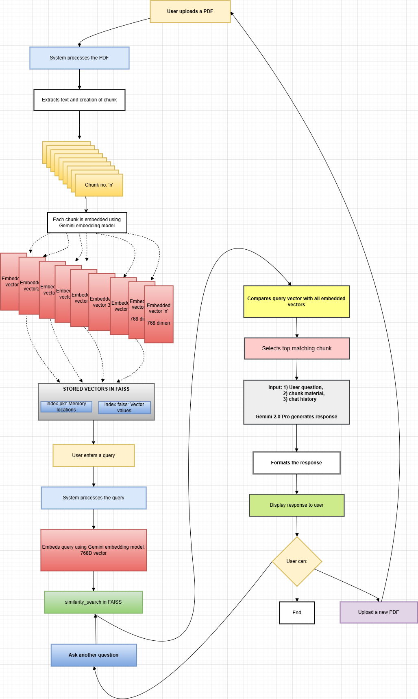
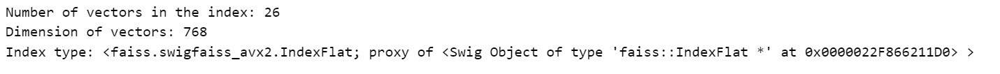

# 📄 DocChat: AI-Powered PDF Chatbot with RAG

Interact with your documents like never before! **DocChat** is an AI-powered chatbot that lets you upload PDFs, get smart summaries, and chat with your documents — all with the power of **Retrieval-Augmented Generation (RAG)**.

🔗 **[🚀 Try it Live on Hugging Face Spaces](https://huggingface.co/spaces/nitish-11/RAG-chat-with-pdf)**

---

## ⚙️ Tech Stack

- 🤖 **Google Gemini 2.0 Pro** – Delivers intelligent, context-aware responses
- 📚 **FAISS Vector Store** – Enables efficient, high-speed document retrieval
- 🔗 **LangChain** – Connects language models with retrieval systems seamlessly
- 🎨 **Streamlit** – Builds an intuitive and responsive web UI

---

## ✨ Features

- 📂 **Upload PDFs**: Drag and drop PDF files and preview them instantly  
- 📑 **Summarize Content**: Automatically generate concise and intelligent summaries  
- 💬 **Chat with Your Docs**: Ask natural language questions and get context-aware answers  
- ⚡ **RAG-Powered Backend**: Combines retrieval with generation for accurate and grounded responses

---

## 📸 Backend Logic

**RAG Chatbot Flowchart:**
- Process followed for the DocChat.  
  

**Embedding Vectors in FAISS:**
- From the 276-page PDF, only 26 embedding vectors were generated due to a chunk size of 20k. This highlights Gemini 2.0's ability to handle long-context inputs, making PDF interactions more flexible and dynamic.  
  
  
  
